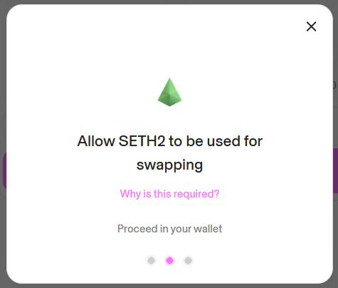

# SWISE-ETH Liquidity Pool

```mdx-code-block
import Tabs from '@theme/Tabs';
import TabItem from '@theme/TabItem';
```

#### Adding liquidity to the new SWISE-ETH pool

This guide will walk you through the process of adding liquidity to the SWISE-ETH pool on Uniswap V3. Follow the simple steps below to proceed.

:::info
If you are a liquidity provider in the SWISE-sETH2 pool and are looking to migrate liquidity to the SWISE-ETH pool, we have included the instructions for removing liquidity and swapping sETH2 for ETH [here](../../intro.mdx).
:::

## Add Liquidity to the new ETH-SWISE pool

<b>Step 1:</b> Head to the [UniSwap Pools](https://app.uniswap.org/pools) page and
select New Position. Click the drop-down to select SWISE to pair vs ETH.


<b>Step 2:</b> Edit the Fee Tier, selecting 0.3% and select Full Range.


:::warning
IMPORTANT — Double check that the correct pool is selected (0.3% fee tier) and that the price range shows 0 to infinity as per the below. Failure to do so will mean you might not receive incentives.
:::


<b>Step 3:</b> Once you are happy with the pool settings, enter the amount of ETH
and SWISE tokens you wish to deploy (must be 50/50 if Full Range). Once again, you
may need to provide UniSwap with approval to access your SWISE tokens. Once the approval
has been granted, you can finally Preview and accept the transaction to deploy your
liquidity.


:::success
Congratulations — you are now an LP in the new SWISE-ETH pool 🥳
:::

## Migrating liquidity from the SWISE-sETH2 pool

### Remove SWISE-sETH2 liquidity

<b>Step 1:</b> Head to the [UniSwap Pools](https://app.uniswap.org/pools) page, select
your SWISE-sETH2 position and click Remove Liquidity.


<b>Step 2:</b> Click Max and then Remove to initiate the transaction to remove your
entire liquidity position, including previously unclaimed fees. Confirm the transaction
in your wallet.


:::success
Congratulations - you successfully removed liquidity from the SWISE-sETH2 pool 🥳
:::

### Swap sETH2 to ETH

<b>Step 1:</b> Head to the [UniSwap Swap](https://app.uniswap.org/swap?chain=mainnet)
page and select sETH2 to ETH. Enter the amount of sETH2 you wish to exchange and
confirm the swap. Note, you may need to enable spending of sETH2 on UniSwap prior
to executing the swap. This will be an on-chain transaction.


<b>Step 2:</b> Once the transaction enabling sETH2 spending is completed, you then
need to allow sETH2 for swapping (simply signing a message rather than an on-chain
transaction).



<b>Step 3:</b> Finally, confirm the swap transaction in your wallet.

:::success
Congratulations - you successfully swapped sETH2 for ETH 🥳
:::
