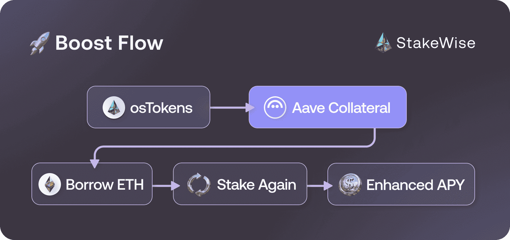

# Boost Feature

## How Boost Works

StakeWise Boost enhances staking rewards by using osETH as collateral to borrow additional assets on [Aave ↗](https://aave.com/). This borrowed capital is then staked again, creating a "looped" process that amplifies your staking position:

- **6x looping** in Vaults with 90% LTV
- **14x looping** in Vaults with 100% LTV
- **Up to 3x boost** in staking rewards compared to normal staking

:::custom-tips[Expected Returns]
The strategy extracts the difference between additional staking rewards and Aave borrowing costs, historically delivering 4-6% APY with peaks around 7%.
:::

### Safety Mechanisms

:::custom-info[Liquidation Protection]
**Max LTV**: 93% – the maximum you can borrow against your osETH collateral

**Liquidation Threshold**: 95% – when positions become subject to liquidation

**Safety Buffer**: 2% – substantial protection before liquidation risk<a href="#fn-1" id="fnref-1">1</a>
:::

#### Price Stability Protection

Boost eliminates depeg-related liquidation risks through Aave's use of StakeWise's native price feed for osETH instead of volatile secondary market prices. This means osETH price fluctuations on DEXs cannot trigger liquidations, as your collateral value always equals the osETH redemption value rather than market price. This design ensures that temporary market volatility doesn't endanger your boosted position.

#### Automatic Unboost

As an additional safety layer, Boost includes an automatic unboost mechanism that activates when positions approach the liquidation threshold. When any boosted position reaches 94.5% LTV, anyone in the community can trigger an automatic unboosting transaction to protect the user. The StakeWise core team actively monitors all boosted positions and will trigger these protective exits when necessary, with all funds always remaining under the original owner's control.

### How to Use Boost

:::custom-info[Prerequisites]
To use Boost, you need osETH in your wallet. If you don't have any, see the [staking guide →](/docs/guides/staking/intro) for instructions on minting osETH from your stake.
:::

#### Boosting Process

1. **Go to your Vault page** and find the **"Boost"** section
2. **Click plus (+) button** to start the boost process
3. **Enter the amount** of osETH to boost in the input field
4. **Review boost details** and confirm the transaction in your wallet
5. **View your position** – Check your boosted osETH balance and enhanced APY in Position changes

#### Unboosting Process

1. **Go to your Vault page** and find the **"Boost"** section
2. **Click minus (–) button** to start the unboost process
3. **Enter the amount** of osETH to unboost in the input field
4. **Confirm the transaction** – Your request enters the unboost queue
5. **Monitor processing time** and claim assets when available

### Risks & Limitations

Two market-driven conditions can affect your Boost position:

#### Borrow APY Exceeds Staking APY

Boost generates returns from the spread between your Vault's staking APY and Aave's variable WETH borrow APY.
Boost APY is positive when the borrow APY is lower than the staking APY, and negative when the borrow APY exceeds the staking APY.

When the borrow APY is lower than the staking APY, your LTV gradually decreases, making your position progressively safer.
When the borrow APY exceeds the staking APY, your LTV gradually increases.

:::custom-warning[Negative APY Alert]
If you see a negative APY on your Boost position, it means the WETH borrow APY on Aave currently exceeds your Vault's staking APY.
If the APY remains negative for more than 7 consecutive days, consider exiting Boost manually.
Stay connected with the [StakeWise Discord ↗](https://discord.com/invite/2BSdr2g) community for real-time updates on market conditions.
:::

You can monitor the current WETH variable borrow APY in the **Borrow Info** section of the [WETH reserve on Aave ↗](https://app.aave.com/reserve-overview/?underlyingAsset=0xc02aaa39b223fe8d0a0e5c4f27ead9083c756cc2&marketName=proto_mainnet_v3).

#### osETH Supply Cap Reached

Boost deposits osETH as collateral on Aave, which enforces a maximum supply cap.
When total supplied osETH reaches this cap, no additional osETH can be deposited, making it impossible to open new boosted positions.
Existing boosted positions are not affected, but new boosts cannot be initiated until supply drops below the cap.

You can monitor the current supply usage in the **Supply Info** section of the [osETH reserve on Aave ↗](https://app.aave.com/reserve-overview/?underlyingAsset=0xf1c9acdc66974dfb6decb12aa385b9cd01190e38&marketName=proto_mainnet_v3).

:::custom-notes[Further Reading]
- [Maximize Your Rewards With StakeWise Boost ↗](https://blog.stakewise.io/productUpdate/maximize-your-rewards-with-stakewise-boost)
- [How StakeWise Boost Keeps Your Rewards Juicy & Your Stake Safe ↗](https://blog.stakewise.io/caseStudy/how-stakewise-boost-keeps-your-rewards-juicy-and-your-stake-safe)
:::

  1. The 2% safety buffer provides substantial protection because, based on historical analysis of 420 days: LTV increases only ~10.7% of the time (39 days per year), with the longest negative streak being just 7 days during Genesis Vault validator rotation. Even in extreme scenarios where borrow APYs consistently exceed osETH APY by 2%, liquidation would take over a year. For every 1 day of LTV increase, users benefit from 8 days of LTV decline, making positions progressively safer over time.
  <a href="#fnref-1" style={{color: 'var(--ifm-color-content-secondary)', textDecoration: 'none'}}>↩</a>

