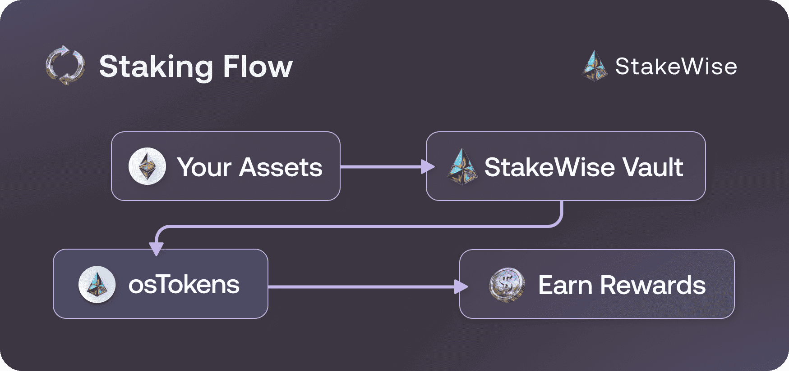

import Admonition from '@theme/Admonition';

# How to stake with one click?

One-click staking routes your assets through a MetaVault that automatically distributes them among selected Vaults. This converts your assets into osTokens, StakeWise's liquid staking tokens, while providing diversified exposure across multiple professional operators.

:::custom-notes[Wallet Requirements]
You'll need an Ethereum wallet such as [Rabby Wallet ↗](https://rabby.io/).
The process will look very similar in other wallets.
:::

:::custom-info[What are osTokens?]
osTokens (osETH on Ethereum, osGNO on Gnosis Chain) represent your staked assets plus accumulated rewards. Use osTokens to trade, borrow, restake, or instantly unstake your staked assets via liquidity pools. [Learn more about osTokens →](/docs/ostoken/intro)
:::

1. **Open [StakeWise App ↗](https://app.stakewise.io)** and connect your wallet
2. **Click the "Stake"** button to begin one-click staking
3. **Enter the amount** you want to stake in the input field
4. **Review conversion details** - The interface shows osTokens you'll receive, current rate, and estimated rewards
5. **Click "Stake"** and confirm the transaction in your wallet
6. **Wait for confirmation** (12-30 seconds) - osTokens will appear in your wallet and you start earning rewards

:::custom-warning[Important Notes]
Ensure you have enough balance for both staking and gas fees for the transaction.
:::

:::custom-info[Next Steps After Staking]
**Track your rewards** – osToken value increases over time as rewards accumulate

**Use your osTokens** – Trade, provide liquidity, or use in DeFi protocols while earning staking rewards

**Convert back anytime** – Swap osTokens back to the underlying asset through the app or exchanges when needed
:::
