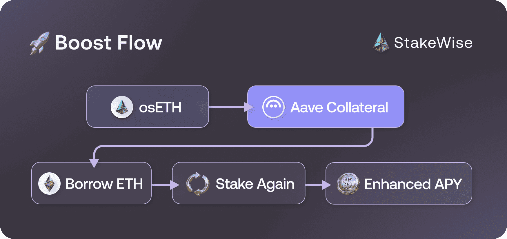
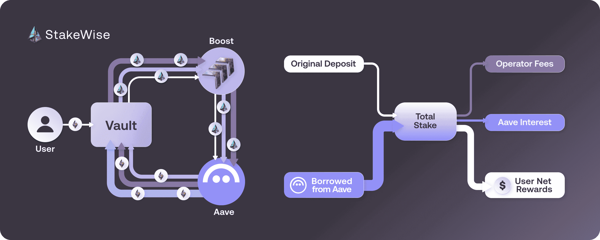
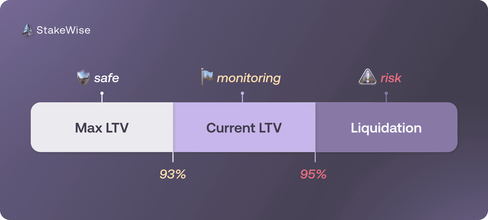

# Boost

## What Is Boost?

StakeWise Boost is a yield amplification strategy that profits from the difference between the extra staking rewards and the cost of sourcing additional ETH.

Boost uses osETH as collateral to borrow additional ETH on Aave and stake it again, creating a "looped" process that amplifies your staking position:

- **6x looping** in Vaults with 90% LTV
- **14x looping** in Vaults with 100% LTV
- **Up to 3x boost** in staking rewards compared to normal staking

Over the mid term (6+ months holding period), Boost historically generates ~1–3 percentage points above the base staking rate, depending on the spread between staking rewards and Aave borrow rates, for a total APY of approximately **4–6%**.

## How Boost Works

Built into every Vault by default, Boost combines your original deposit with ETH borrowed from Aave into a single staking position.
You deposit osETH into Boost via the Vault or Stake page.
Boost then uses your osETH as collateral on Aave to borrow additional ETH.
The borrowed ETH is staked in the Vault on your behalf.
This process repeats automatically.

Staking rewards are earned on the entire amount — so even after deducting Aave interest and operator fees, your net rewards are far greater than staking your original deposit alone — and StakeWise charges no additional fee for using Boost. Boost does not rely on the secondary market for repaying debt, so your strategy profit is not affected by slippage during exits.

Boost replaces 40+ manual steps with a single click, allowing even novice users to amplify their staking rewards without navigating the complex DeFi landscape —
with exposure limited to the node operators of your chosen Vault and the smart contracts of StakeWise and Aave.

## Safety

### Price Stability Protection

Boost eliminates depeg-related liquidation risks through Aave's use of StakeWise's native price feed for osETH instead of volatile secondary market prices. This means osETH price fluctuations on DEXs cannot trigger liquidations, as your collateral value always equals the osETH redemption value rather than market price. This design ensures that temporary market volatility doesn't endanger your boosted position.

### Safety Mechanisms

LTV (Loan-to-Value) is the ratio of your borrowed amount to the value of your collateral. For example, at 93% LTV, you can borrow 0.93 ETH against an osETH deposit worth 1 ETH.
Three key LTV metrics determine how safe your boosted position is:

**Max LTV**: 93% – the maximum you can borrow against your osETH collateral when initiating a loan

**Current LTV** – the value of your loan relative to your collateral right now, influenced by the Aave borrow rate and osETH APY over time

**Liquidation Threshold**: 95% – the point at which a position is considered undercollateralized and subject to liquidation

The 2% gap between Max LTV and Liquidation Threshold acts as a safety buffer, providing substantial protection before any liquidation risk.<a href="#fn-1" id="fnref-1">1</a>

Current LTV and Liquidation Threshold are the key variables for maintaining a healthy borrow position and avoiding liquidation.

### Automatic Unboost

As an additional safety layer, Boost includes an automatic unboost mechanism that activates when positions approach the liquidation threshold. When any boosted position reaches 94.5% LTV, anyone in the community can trigger an automatic unboosting transaction to protect the user.
The StakeWise core team actively monitors all boosted positions and will trigger these protective exits when necessary, with all funds always remaining under the original owner's control.

## Risks & Limitations

Two market-driven conditions can affect your Boost position:

### Borrow APY Exceeds Staking APY

Boost APY depends on the spread between your Vault's staking APY and Aave's variable WETH borrow APY.
Boost APY is positive when the borrow APY is lower than the staking APY, and negative when the borrow APY exceeds the staking APY.

When the borrow APY is lower than the staking APY, your LTV gradually decreases, making your position progressively safer.
When the borrow APY exceeds the staking APY, your LTV gradually increases.

:::custom-warning[Negative APY Alert]
If you see a negative APY on your Boost position, it means the WETH borrow APY on Aave currently exceeds your Vault's staking APY.
If the APY remains negative for more than 7 consecutive days, consider exiting Boost manually.
Stay connected with the [StakeWise Discord ↗](https://discord.com/invite/2BSdr2g) community for real-time updates on market conditions.
:::

You can monitor the current WETH variable borrow APY in the **Borrow Info** section of the [WETH reserve on Aave ↗](https://app.aave.com/reserve-overview/?underlyingAsset=0xc02aaa39b223fe8d0a0e5c4f27ead9083c756cc2&marketName=proto_mainnet_v3).

### osETH Supply Cap Reached

Boost deposits osETH as collateral on Aave, which enforces a maximum supply cap.
When total supplied osETH reaches this cap, no additional osETH can be deposited, making it impossible to open new boosted positions.
Existing boosted positions are not affected, but new boosts cannot be initiated until supply drops below the cap.

You can monitor the current supply usage in the **Supply Info** section of the [osETH reserve on Aave ↗](https://app.aave.com/reserve-overview/?underlyingAsset=0xf1c9acdc66974dfb6decb12aa385b9cd01190e38&marketName=proto_mainnet_v3).

:::custom-notes[Guide]
To start using Boost, see [How to Use Boost →](/docs/guides/defi/how-to-use-boost)
:::

:::custom-notes[Further Reading]
- [StakeWise Boost: A DeFi-Native Yield Amplification Strategy Made Simple ↗](https://blog.stakewise.io/caseStudy/stakewise-boost-a-defi-native-yield-amplification-strategy-made-simple)
- [Maximize Your Rewards With StakeWise Boost ↗](https://blog.stakewise.io/productUpdate/maximize-your-rewards-with-stakewise-boost)
- [How StakeWise Boost Keeps Your Rewards Juicy & Your Stake Safe ↗](https://blog.stakewise.io/caseStudy/how-stakewise-boost-keeps-your-rewards-juicy-and-your-stake-safe)
:::

  1. Based on the <a href="https://blog.stakewise.io/caseStudy/how-stakewise-boost-keeps-your-rewards-juicy-and-your-stake-safe#:~:text=Scenario%201%3A%20When,passing%20day." target="_blank" rel="noopener noreferrer">historical analysis of 420 days</a>, LTV increases only ~10.7% of the time (39 days per year). On the remaining days, LTV actually decreases — for every 1 day of LTV increase, there are ~8 days of decline, making positions progressively safer over time. Even in an extreme scenario where borrow APY consistently exceeds osETH APY by 2%, starting from 93% LTV, liquidation would take over a year. As for mass slashing, breaching the 2% buffer would require 480–1,150 validators to be slashed across the protocol simultaneously — an event that has never occurred in StakeWise's 4-year history.
  <a href="#fnref-1" style={{color: 'var(--ifm-color-content-secondary)', textDecoration: 'none'}}>↩</a>

