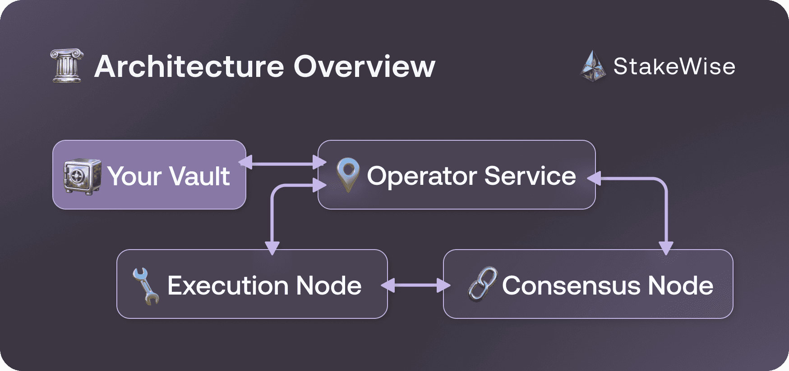

import Tabs from '@theme/Tabs';
import TabItem from '@theme/TabItem';
import Admonition from '@theme/Admonition';
import useBaseUrl from '@docusaurus/useBaseUrl';

# Overview

:::custom-warning[Operator V3 Documentation]
You must run Operator Service v3.1.10 and follow this documentation page if your Vault version is below 5 on Ethereum or below 3 on Gnosis.
You can check your Vault contract version in the Details section of the Vault page or on the contract page in the block explorer. If your Vault version is higher, please refer to the [latest documentation →](/operator/intro).
:::

**StakeWise** is a decentralized liquid staking protocol that allows anyone to participate in Ethereum staking without the traditional barriers of technical complexity or capital requirements. The protocol enables users to stake their ETH while maintaining liquidity through [osToken →](/docs/ostoken/intro), StakeWise's liquid staking token.

At the core of StakeWise are individual staking pools called [Vaults →](/docs/vaults/intro). Anyone – from solo stakers to professional operators – can create and operate their own Vault, offering flexible staking solutions that serve diverse needs: solo stakers can access liquid staking for their own ETH, while individuals and organizations can stake on their terms and offer liquid staking services to others.

**Deploying a Vault requires running the StakeWise [Operator Service ↗](https://github.com/stakewise/v3-operator)** – specialized software that manages validator operations and ensures your Vault functions properly. Each Vault must have at least one node operator running this service to handle validator registrations, exits, and other critical operations that keep the Vault operational.

## Core Functions

The Operator Service integrates seamlessly with any node setup, supporting your preferred execution and consensus clients, MEV relay, and distributed validator technology.
The Operator Service is indispensable in order to successfully register validators on the platform
and manage your Vault's validator lifecycle — from automated registration through exit signature maintenance and state synchronization.

### Validator Registration

The Operator Service periodically checks whether the Vault has accumulated enough assets for registering new validators (32 ETH for Ethereum, 1 GNO for Gnosis) and sends a registration transaction to the Vault.
Validator registration requires pre-generated deposit data files that must be uploaded to your Vault.

:::custom-notes[Deep Dive]
For detailed information about the validator registration process, see [Validator Registration →](/docs/vaults/how-vaults-work#validator-registration)
:::

### Exit Signatures Rotation

Exit signatures can become invalid if the oracle set changes. The Operator Service periodically checks active validators and updates outdated exit signatures by submitting rotation transactions to the Vault.

### Vault State Update (Optional)

Keeps your Vault synced by calling the `updateState` function every 12 hours.
Enable this by passing the `--harvest-vault` flag to the start command. This simplifies contract interactions and reduces gas costs for your depositors.
By default, Vault state updates occur automatically whenever users interact with the Vault through deposits or withdrawals (with a 12-hour cooldown between updates).

## Next Steps

Before running the Operator Service, ensure your infrastructure meets the necessary [Prerequisites →](./prerequisites) outlined in the next section.
